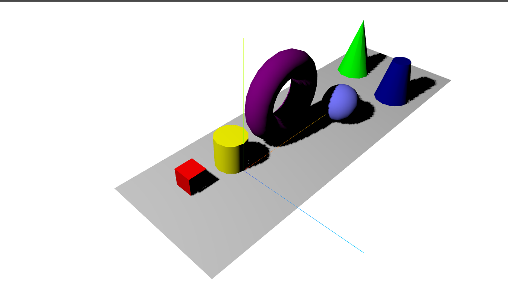
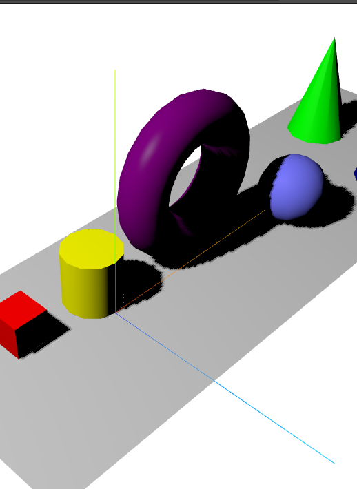
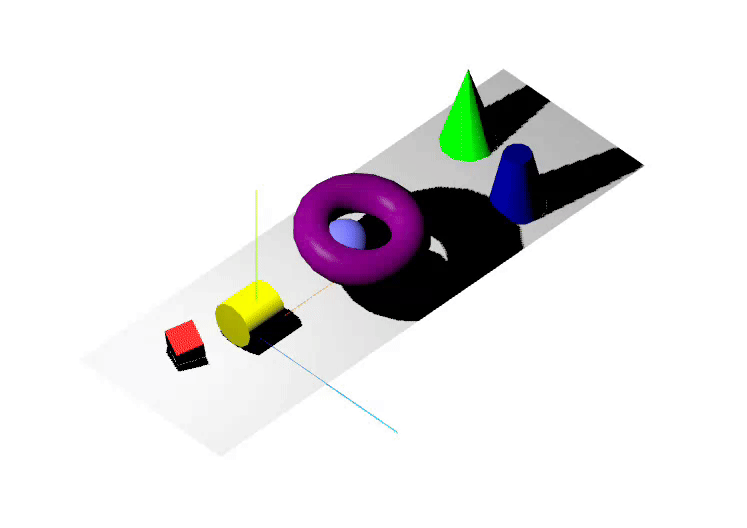

## lab3 notes and answers

1.1 

The following models are defined before any changes were made

- The plane
- The AxesHelper
- A Cube
- A sphere

**The plane** is horizontal to the ground, the rotation is applied so that the surface is horizontal (-pi/2) because by default it is a vertical surface. It is positioned in the coordinates (15,0,0)

**The AxesHelper** is placed on (0,0,0) and each axis has a length of 20. It is not rotated. It helps visualize the placement of the other models

**The cube** is not rotated, it's positioned at (-4, 1.5, -3), because of the edges we need to set the height to 1.5 (center of the cube) so that we can have one of its faces touching the plane

**The sphere** is not rotated. It's placed on (20, 3, 2). Much like the cube it needs to be placed above the plane so that there's only a point touching the surface.

If I remove the lines of code that define the cube or sphere's position, they will be placed at (0,0,0), which means they would be divided in half by the surface. We wouldn't be able to see the half beneath the surface due to the camera angle

**The camera** is placed at (-30, 40, 30). It's looking directly to the center of the scene (to the (0,0,0) point)

1.2

When I add the spotlight, **nothing happens** because the basic material does not get affected by spotlights or directed lights. When I change the material, the light is visible. 

Above is the results with Lambert Material

Above is the results with the Phong Material

Torus with shininess = 0

Torus with shininess = 100

1.4

Orthographic Camera

It looks more realistic with the first example, as it says in the documentation the orthographic camera is more useful for 2D (2.5D) graphics while the perspective camera matches more closely the human eye.

TO setup the Orthographic Camera you use a constructor similar to the perspective camera. But the "borders" of the camera are defined in this constructor (top bottom left right) - it's still looking at the center of the scene (0, 0, 0)

The size of models is also different, while in orthographic camera the sizes are the same, in the perspective camera the sizes appear different according to the distance to the camera

