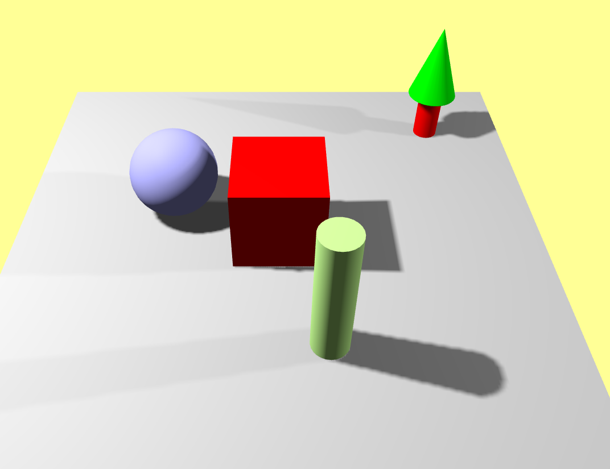
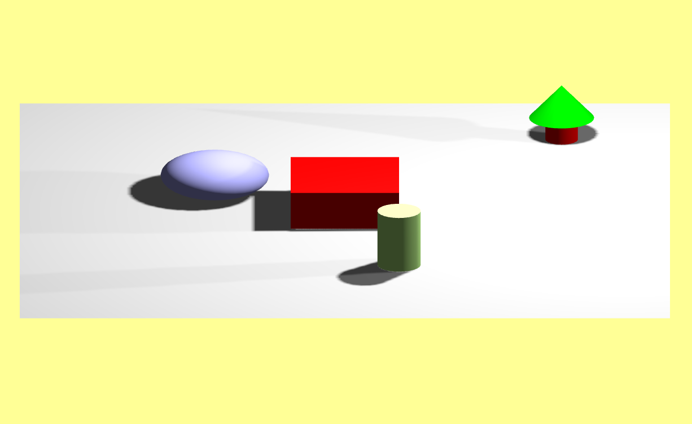

## Disclaimer

All the tasks are done in the 04_Ex_interaction directory, following the teacher's suggestion.

All the other files remain unchanged

-------------

## 1.1

Scene with Perspective Camera

Scene with Ortographic Camera

You can tell that with the Perspective Camera, things that are farther away get smaller, opposed to the Orthographic Camera